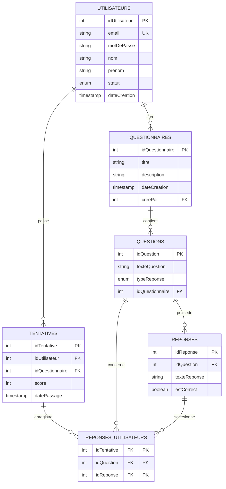

# Projet Quizz

Application de quizz permettant aux utilisateurs de passer des questionnaires à choix multiples.

## Description

Cette application se compose de deux parties :
- Une application Android (interface utilisateur) : [QuizzFront](https://github.com/HugoBiegas/QuizzFront)
- Une API REST (backend) : [QuizzApi](https://github.com/HugoBiegas/QuizzApi)

## Fonctionnalités

### Authentification
- Connexion avec identifiants (login/mot de passe)
- Création de compte pour les nouveaux utilisateurs

### Gestion des questionnaires
- Liste des questionnaires disponibles
- Historique des questionnaires réalisés
  - Date du dernier passage
  - Score obtenu
  - Historique des résultats

### Passage des questionnaires
- Questions à choix multiples
- Possibilité d'avoir une ou plusieurs bonnes réponses par question
- Navigation unidirectionnelle (pas de retour en arrière possible)
- Affichage du score à la fin du questionnaire

### Optionelle
- Connection en temps que admin pour ajouter des questions et des questionnaires
- Pouvoir modifier les drois des utilisateurs et accepter les nouveaux entrants
- Pouvoir modifier les questionnaires, questions, reponses
- Pouvoir ajouter des questions et des questionnaires

### Affichage sur l'application Android

- Page de connexion pour les deux types d'utilisateurs
  - deux input type text pour le email et le mot de passe
  - un bouton pour se connecter
  - un bouton pour créer un compte

- Page de création de compte
  - quatre input type text pour le email, le mot de passe, le nom et le prenom
  - un input type email pour l'email
  - un input type password pour le mot de passe
  - un input type text pour le nom et le prenom
  - un bouton pour créer un compte

- Pour les utilisateurs normaux :
  - Page d'acceuil
    - Deux listView :
      - Liste des questionnaires disponibles
      - Historique des questionnaires réalisés
      
  - Page de questionnaire :
    - Une listView pour les questions
    - Un bouton pour valider les réponses
    - Un bouton pour quitter le questionnaire
    - une modal pour afficher le score

- Pour les utilisateurs admin :
  - navigation vertical entre les pages acceuil et les pages de gestion
    - Page d'acceuil
      - Deux listView :
        - Liste des questionnaires disponibles
        - Historique des questionnaires réalisés
      - Un bouton pour ajouter un questionnaire
      - Un bouton pour modifier un questionnaire
    - Page de gestion
      - deux listView:
        - pour les utilisateurs à valider
        - pour les utilisateurs validés
      - un bouton pour ajouter un utilisateur
      - un bouton pour modifier un utilisateur
      - un bouton pour supprimer un utilisateur
      - un bouton pour accepter un utilisateur
  - Page de questionnaire :
    - Une listView pour les questions
    - Un bouton pour valider les réponses
    - Un bouton pour quitter le questionnaire
    - une modal pour afficher le score


## Structure de la base de données
## Schéma relationnel


## Description des tables

### Tables principales
- `utilisateurs` - Stockage des utilisateurs et gestion des droits
   - Statuts : Profeseur, Etudiant, En attente
   - Données : email, mot de passe, nom, prénom

- `questionnaires` - Liste des questionnaires 
   - Données : titre, description, auteur, date de création

- `questions` - Questions des questionnaires
   - Types : choix unique ou multiple

### Tables de réponses
- `reponses` - Réponses possibles
   - Indication correcte/incorrecte
   - Liées à une question spécifique

### Tables de suivi
- `tentatives` - Historique des quiz passés
   - Score obtenu
   - Date de passage

- `reponses_utilisateurs` - Détail des réponses 
   - Enregistrement des choix utilisateur
   - Liée aux tentatives

## Installation

### Prérequis
- Java 17+
- Docker ou MySQL 8
- IntelliJ IDEA

### Base de données
Lancer le script `bddquizz.sql` pour initialiser la base de données.
Pour se faire executer les commandes docker a l'emplacemnt du fichier `bddquizz.sql` :

Pour linux :
```bash
docker run --name mysql-spring -e MYSQL_DATABASE=bddquizz -e MYSQL_ROOT_PASSWORD=root -e MYSQL_USER=springuser -e MYSQL_PASSWORD=springpassword -v $(PWD)/bddquizz.sql:/docker-entrypoint-initdb.d/bddquizz.sql -p 3306:3306 -d mysql:8
```
Pour windows : 
```bash
docker run --name mysql-spring -e MYSQL_DATABASE=bddquizz -e MYSQL_ROOT_PASSWORD=root -e MYSQL_USER=springuser -e MYSQL_PASSWORD=springpassword -v ${PWD}/bddquizz.sql:/docker-entrypoint-initdb.d/bddquizz.sql -p 3306:3306 -d mysql:8
```
